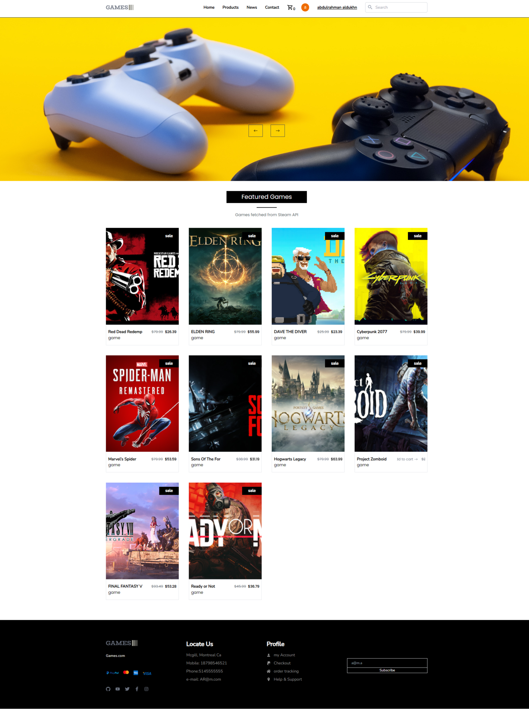
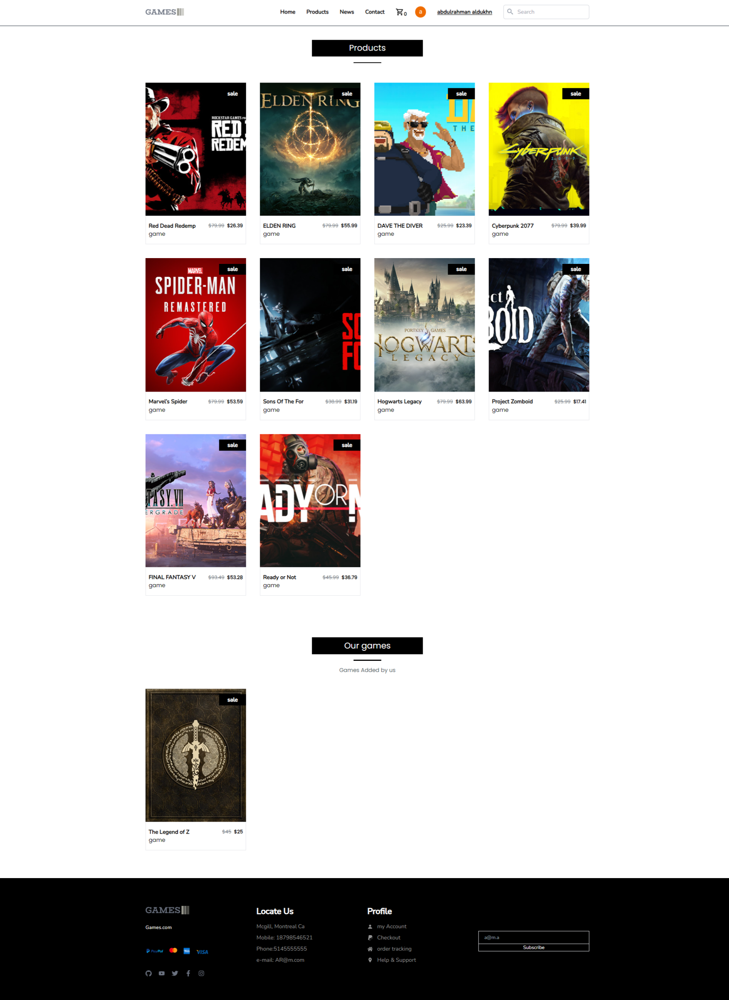
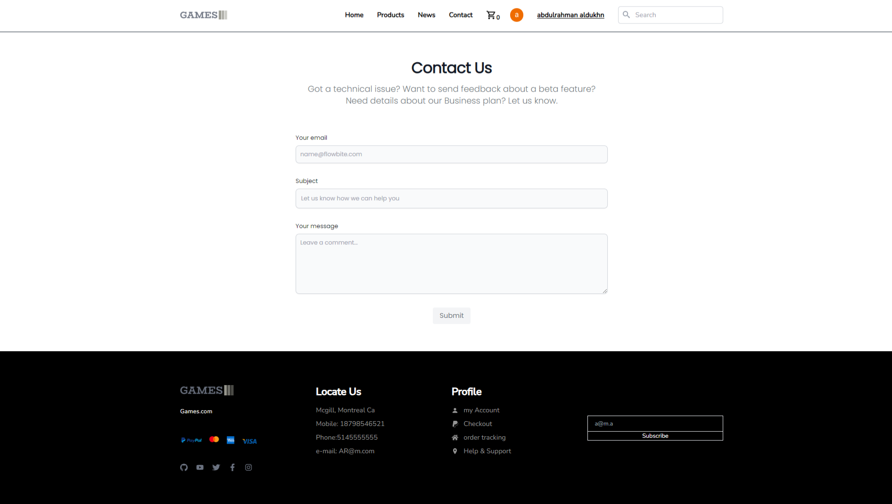
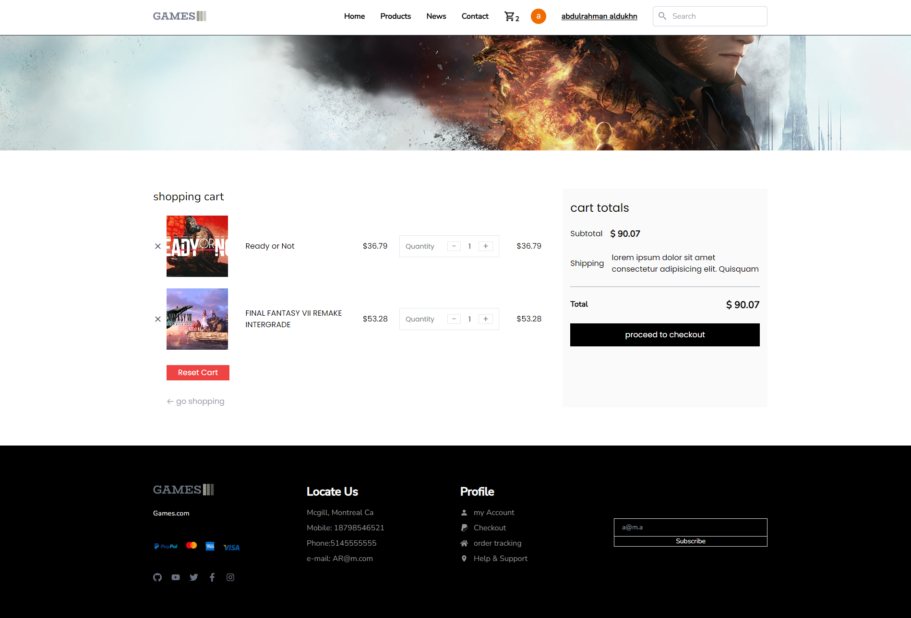
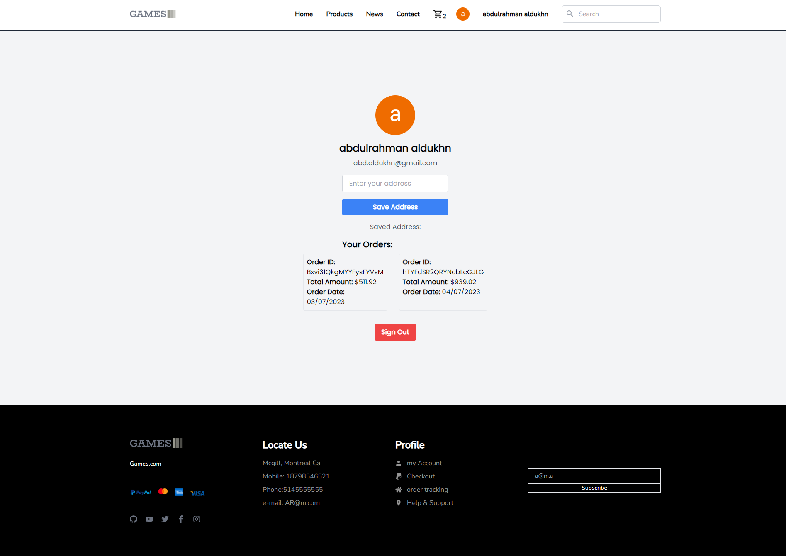
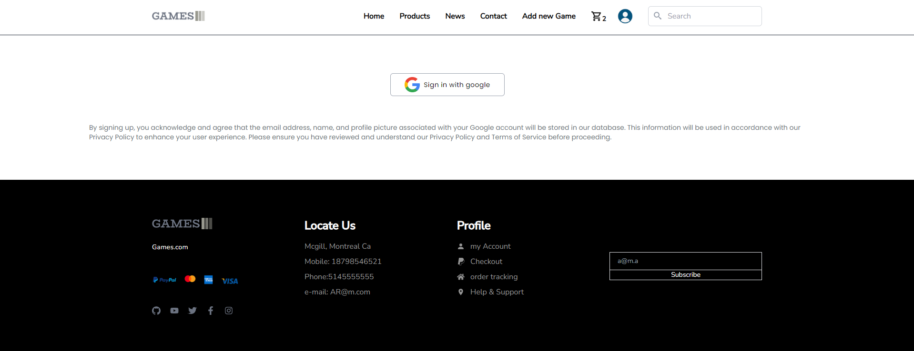

# Video Games E-commerce Website (YCIT-030-Project)

This is a video games e-commerce website built with the following technologies:

- **Frontend:** React, Redux, Redux Persist, TailwindCSS, Axios, Stripe, React Toastify
- **Backend:** Node.js, Express
- **Database:** Firebase, Firestore

## Features

- Shopping cart
- User authentication
- Stripe payment integration
- React-Toastify notifications
- Firebase Auth
- Firestore database
- Add new games by admin

## New Features

- Search for items in the header
- Quantity in cart

## ScreenShots

### Home Page

### Products Page

### Contact Page

### Cart Checkout

### User Profile

### Sign In Page

